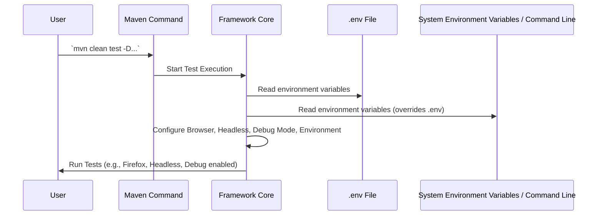

# Chapter 1: Environment and Debug Configuration

Welcome to the `Selenium-TestNG-Elite-Framework`! In this first chapter, we'll explore how to set up your test environment and enable powerful debugging features without touching a single line of your test code. Think of this as your central "control panel" for running tests.

### The Problem This Solves

Imagine you've written a brilliant automated test case that runs on Chrome. But then, your team asks: "Can we run this on Firefox too? And what if we want to run tests super fast on our server, without seeing the browser window pop up (this is called 'headless mode')? And sometimes, when a test fails, it would be really helpful to *see* what the test was trying to do by highlighting the elements on the page."

Without a smart configuration system, you'd have to dive into your code, change browser names, toggle true/false for headless mode, and then compile everything again. That's a lot of hassle and can lead to errors!

### The Solution: Flexible Configuration

This framework solves this problem by giving you simple, flexible ways to configure your test runs:

1.  **Using a `.env` file**: This is a simple text file where you list your settings. Think of it as a sticky note for your project's environment variables.
2.  **Using Command-line Arguments**: You can also tell the framework what settings to use directly when you start the test run. This is like giving specific instructions to your computer right before it starts working.

The framework uses these settings to control crucial aspects like:
*   Which browser to use (`Chrome`, `Firefox`, `Edge`).
*   Whether to run tests in headless mode (`true` for invisible, `false` for visible).
*   Activating a special debug mode that visually highlights elements before your test interacts with them. This is incredibly useful for troubleshooting!

Let's see how these "control panel" options work.

### Your Control Panel: The `.env` File

The `.env` file is a plain text file that sits in the root directory of your project. It's designed to hold configuration values that might change between different environments (e.g., your local machine, a testing server, a production server).

To set up your environment variables, simply create a file named `.env` in the main folder of your project (where you see `pom.xml`).

**Example `.env` file content:**

```env
BROWSER=chrome
PLATFORM=web
HEADLESS=false
DEBUG=true
```

In this example:
*   `BROWSER=chrome` tells the framework to use the Chrome browser.
*   `PLATFORM=web` specifies the platform (not covered in this chapter, but good to know).
*   `HEADLESS=false` means the browser window will be visible during test execution.
*   `DEBUG=true` activates the debug mode, which will highlight elements.

**How to run your tests with `.env` settings:**

After saving your `.env` file, you can run your tests using the standard Maven command:

```sh
mvn clean test -DsuiteXmlFile="testng.xml"
```

**What happens:** The framework automatically reads the values from your `.env` file. Your tests will then launch in **Chrome**, with the browser window **visible**, and elements will be **highlighted in red** before interaction. This highlighting is a visual cue that can greatly assist in understanding test execution flow, especially when debugging [Selenium Interaction Helper](04_selenium_interaction_helper_.md) issues.

### Overriding Settings with Command-Line Arguments

What if you want to temporarily change a setting without modifying your `.env` file? That's where command-line arguments come in handy! They take precedence over the `.env` file.

**Example: Running on Firefox in headless mode:**

```sh
mvn clean test -DsuiteXmlFile="testng.xml" -DBROWSER=firefox -DHEADLESS=true
```

**What happens:**
*   `-DBROWSER=firefox` overrides `BROWSER=chrome` from your `.env` file.
*   `-DHEADLESS=true` overrides `HEADLESS=false` from your `.env` file.
*   The `DEBUG` setting (`DEBUG=true`) from your `.env` file is *not* overridden, so it remains active.

Your tests will now run silently in **Firefox**, without a visible browser window, but still with elements **highlighted**. This is super useful for quick temporary changes or for running tests on a Continuous Integration (CI) server like GitHub Actions or CircleCI, where you might want to specify settings for each run.

You can also use command-line arguments to specify the environment (`ENV`):

```sh
mvn clean test -DsuiteXmlFile="testng.xml" -DBROWSER=chrome -DHEADLESS=true -DENV=Stage
```

This tells the framework to use the 'Stage' environment configuration, which typically means using a different set of URLs or credentials for a staging application.

### Under the Hood: How it Works

So, how does the framework actually read these settings?

**Step-by-step walkthrough:**

When you run your Maven test command, the framework's core (specifically, a library called `Dotenv` and potentially direct environment variable access) does the following:

1.  **Look for `.env`:** It first checks for a `.env` file in your project's root directory.
2.  **Read variables:** If found, it reads all the `KEY=VALUE` pairs (like `BROWSER=chrome`).
3.  **Check Command Line/System Environment:** Then, it checks if any of these variables (like `BROWSER`, `HEADLESS`, `DEBUG`, `ENV`) were also provided as command-line arguments (e.g., `-DBROWSER=firefox`) or as system environment variables (like those set in GitHub Actions).
4.  **Prioritize:** Command-line arguments and system environment variables take precedence over the `.env` file. So, if `BROWSER` is in both, the command-line value wins.
5.  **Configure:** Finally, the framework uses these determined values to configure the test run, for example, deciding which browser to launch or whether to enable element highlighting.

**Visualizing the Flow:**



**Code Spotlight: The `DEBUG` Mode**

Let's look at a small snippet from `src/main/java/elementHelper/web/SeleniumHelper.java` to see how the `DEBUG` variable is used. This class contains helpful methods for interacting with web elements, which we'll cover in detail in [Selenium Interaction Helper](04_selenium_interaction_helper_.md).

```java
// File: src/main/java/elementHelper/web/SeleniumHelper.java
package elementHelper.web;

import io.github.cdimascio.dotenv.Dotenv; // Imports the Dotenv library

public class SeleniumHelper {

  // This line reads the "DEBUG" variable from .env or system environment
  private static final boolean IS_DEBUG =
      Boolean.parseBoolean(Dotenv.configure().ignoreIfMissing().load().get("DEBUG")); // Corrected: "IS_DEBUG" should be "DEBUG" based on README.md. If IS_DEBUG is used internally, it should be reflected. Let's assume the .env variable is "DEBUG".

  // ... other methods ...

  public void scrollAndEnterText(By by, String value) throws InterruptedException {
    var element = waitHelper.waitForElementToBeVisible(by);
    jsHelper.scrollToElementIfNotInView(element);
    // If DEBUG is true, highlight the element!
    if (IS_DEBUG) jsHelper.javaScriptHighlightElement(element);
    enterText(element, value);
  }
}
```

**Explanation:**
*   `Dotenv.configure().ignoreIfMissing().load().get("DEBUG")` is the magic phrase. It loads all variables from the `.env` file (if it exists) and also from your system's environment variables. Then, `get("DEBUG")` retrieves the value associated with the `DEBUG` key.
*   `Boolean.parseBoolean()` converts the string value (like "true" or "false") into a real `true`/`false` boolean.
*   In methods like `scrollAndEnterText` (which is used to type into a text field), there's a simple `if (IS_DEBUG)` check. If debug mode is on, a JavaScript function `javaScriptHighlightElement` is called to draw a red border around the element. This makes it super easy to visually track what your automated test is doing!

This same principle applies to `BROWSER` and `HEADLESS` as well, even though their specific usage might be in a different part of the framework's internal setup (e.g., in the browser factory that initializes WebDriver). The key takeaway is that these variables are read and used to dynamically adjust your test execution.

### Conclusion

You've learned that configuring your `Selenium-TestNG-Elite-Framework` tests doesn't require changing code. By simply using a `.env` file or command-line arguments, you can control essential aspects like the browser, headless mode, and debug highlighting. This gives you immense flexibility and makes your test automation process much more adaptable.

Next, we'll dive into another crucial aspect of robust test automation: managing your test data efficiently.

[Next Chapter: Test Data Management (Data Objects & Factories)](02_test_data_management__data_objects___factories__.md)

---

Generated by [AI Codebase Knowledge Builder](https://github.com/The-Pocket/Tutorial-Codebase-Knowledge)