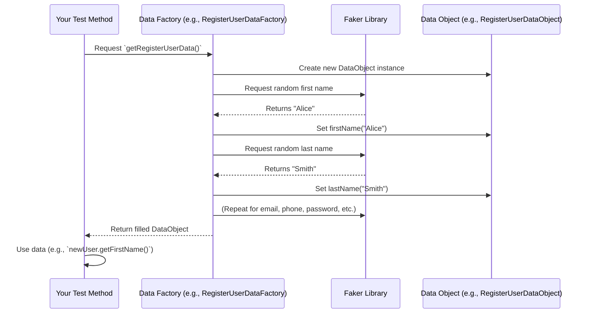

# Chapter 2: Test Data Management (Data Objects & Factories)

Welcome back! In [Chapter 1: Environment and Debug Configuration](01_environment_and_debug_configuration_.md), we learned how to easily configure our tests using `.env` files and command-line arguments. Now, let's move on to another crucial part of building robust and flexible automated tests: managing your test data effectively.

### The Problem This Solves

Imagine you're building an automated test for a user registration page. You need to fill in fields like first name, last name, email, password, etc.

What kind of data would you use?
*   Should it always be "John Doe" with email "john.doe@example.com"?
*   What if you need to test with 10 different *valid* users?
*   What if you need to test with *invalid* data, like an email without an "@" symbol, or a password that's too short?

If you simply type the data directly into your test code ("hardcoding"), your tests become rigid and hard to manage:
1.  **Maintenance Nightmare:** If the test data needs to change (e.g., a valid email format changes), you have to go through every test that uses it and update it manually.
2.  **Limited Scenarios:** It's hard to quickly test with various valid inputs or many different invalid inputs.
3.  **Readability:** Your test code becomes cluttered with data, making it harder to understand the actual test steps.

### The Solution: Separating Test Data

The `Selenium-TestNG-Elite-Framework` solves this by introducing "Test Data Management" through two key concepts: `Data Objects` and `Data Factories`. This approach allows you to create and manage dynamic test data separately from your test logic, making your tests super flexible, easy to maintain, and capable of running with many different inputs.

Let's break down these concepts.

### Concept 1: Data Objects (The Blueprint)

Think of a `Data Object` as a **blueprint** or a **template** for a specific type of test data. It's a simple Java class that defines *what* pieces of information belong together for a particular test scenario.

For example, if you need data for a user registration, you'd define a `RegisterUserDataObject` blueprint that specifies fields like `firstName`, `lastName`, `email`, `password`, etc. It doesn't contain actual data yet, just the structure.

**Analogy:** A `Data Object` is like a **cookie cutter**. It defines the shape of the cookie (e.g., a star), but it doesn't give you the actual cookie itself.

Let's look at an example:

```java
// File: src/main/java/dataObject/loginUser/LoginUserDataObject.java
package dataObject.loginUser;

import lombok.Data; // This line helps create common methods for us

@Data // This annotation automatically adds helpful methods like getters/setters
public class LoginUserDataObject {
  private String email;
  private String password;
}
```

**Explanation:**
*   `@Data`: This is a special annotation from the Lombok library. It's a shortcut that automatically generates common methods like `getEmail()`, `setEmail()`, `getPassword()`, `setPassword()`, `equals()`, `hashCode()`, and `toString()` for you. This keeps your code super clean!
*   `private String email;`: This declares a variable named `email` that will hold a string (text) value.
*   `private String password;`: This declares a variable named `password` for the user's password.

So, this `LoginUserDataObject` is just a simple container, a blueprint, that tells us a "login user" record will always have an `email` and a `password`.

Similarly, for a registration, we have:

```java
// File: src/main/java/dataObject/registerUser/RegisterUserDataObject.java
package dataObject.registerUser;

import lombok.Data;

@Data
public class RegisterUserDataObject {
  private String firstName;
  private String lastName;
  private String email;
  private String telephone;
  private String password;
  private String confirmPassword;
  private boolean subscribe; // true/false for newsletter
  private boolean privacyPolicy; // true/false for privacy policy agreement
}
```
**Explanation:** This `RegisterUserDataObject` is the blueprint for a full user registration record, detailing all the fields needed.

### Concept 2: Data Factories (The Cookie Factory)

If `Data Objects` are the cookie cutters, then `Data Factories` are the **cookie factories**! A `Data Factory` is a class whose job is to *create* and *provide* actual instances of `Data Objects`, filled with real data.

Data factories are powerful because they can:
*   Provide **realistic, random data** using libraries like `Faker` (e.g., generate a random name, email, phone number).
*   Provide **pre-defined valid data** for specific scenarios.
*   Provide **pre-defined invalid data** to test error conditions (e.g., "invalid" email, "too short" password).

**Analogy:** A `Data Factory` uses the cookie cutter (the `Data Object` blueprint) to bake many different cookies (data instances), each with potentially different ingredients (random or specific values).

Let's see an example:

```java
// File: src/main/java/dataFactory/registerUserDataFactory/RegisterUserDataFactory.java
package dataFactory.registerUserDataFactory;

import com.github.javafaker.Faker; // Library to generate realistic fake data
import dataObject.registerUser.RegisterUserDataObject;
// import com.selenium.testng.elite.utils.RandomHelper; // Not used in this snippet, but useful for more randomness

public class RegisterUserDataFactory {

  public static RegisterUserDataObject getRegisterUserData() {
    // 1. Create a new "empty" Register User DataObject (like an empty cookie)
    var registerUser = new RegisterUserDataObject();

    // 2. Use Faker to generate realistic, random data
    var faker = new Faker();
    var password = faker.internet().password(); // Generate a random password

    // 3. Fill the DataObject with the generated data
    registerUser.setFirstName(faker.name().firstName());
    registerUser.setLastName(faker.name().lastName());
    registerUser.setEmail(faker.internet().emailAddress());
    registerUser.setTelephone(faker.phoneNumber().phoneNumber());
    registerUser.setPassword(password);
    registerUser.setConfirmPassword(password); // Password and confirm password should match
    // Note: We might set subscribe/privacyPolicy to true/false here based on test needs
    return registerUser; // 4. Return the filled DataObject
  }

  public static RegisterUserDataObject getInvalidRegisterUserData() {
    // This method would create a DataObject with intentionally bad data
    var registerUser = new RegisterUserDataObject();
    // ... logic to set invalid data, e.g., registerUser.setEmail("notanemail");
    return registerUser;
  }
}
```

**Explanation:**
*   `public static RegisterUserDataObject getRegisterUserData()`: This is a static method (meaning you can call it directly using `RegisterUserDataFactory.getRegisterUserData()` without creating an object of `RegisterUserDataFactory`). It returns a `RegisterUserDataObject`.
*   `new Faker()`: This creates an object from the `Faker` library, which can generate all sorts of realistic-looking fake data (names, addresses, emails, etc.).
*   `faker.name().firstName()`: This calls a `Faker` method to generate a random first name.
*   `registerUser.setFirstName(...)`: We use the `setFirstName` method (automatically created by `@Data` from Lombok) to fill the `firstName` field in our `registerUser` data object.

Similarly, for login data, we have:

```java
// File: src/main/java/dataFactory/loginUserDataFactory/LoginUserDataFactory.java
package dataFactory.loginUserDataFactory;

import dataObject.loginUser.LoginUserDataObject;

public class LoginUserDataFactory {

  public static LoginUserDataObject invalidLoginUserData() {
    var loginUserData = new LoginUserDataObject(); // Create an empty Login User DataObject
    loginUserData.setEmail("invalidEmail"); // Set a fixed invalid email
    loginUserData.setPassword("invalidPassword"); // Set a fixed invalid password
    return loginUserData; // Return the filled DataObject
  }
  // We could add methods like 'getValidLoginUserData()' here as well, possibly from a file or DB.
}
```
**Explanation:** This factory method provides a `LoginUserDataObject` specifically designed for testing invalid login scenarios with pre-defined "bad" credentials.

### How to Use Test Data Management in Your Tests

Now that you have your blueprints (`Data Objects`) and your cookie factories (`Data Factories`), how do you use them in your actual tests? It's super simple!

In your test method, instead of hardcoding data, you simply ask the `Data Factory` for the data you need:

```java
// Example usage in a hypothetical test file (e.g., a TestNG test class)

// import dataObject.registerUser.RegisterUserDataObject; // Already imported if using in the same package
// import dataFactory.registerUserDataFactory.RegisterUserDataFactory; // Already imported

// ... inside a @Test method ...

// 1. Get a new, random valid user for registration
RegisterUserDataObject newUser = RegisterUserDataFactory.getRegisterUserData();

// 2. Now use this data in your test steps
// (These methods would be part of your Page Object Model - Chapter 3)
// registerPage.enterFirstName(newUser.getFirstName());
// registerPage.enterLastName(newUser.getLastName());
// registerPage.enterEmail(newUser.getEmail());
// registerPage.enterPassword(newUser.getPassword());
// registerPage.enterConfirmPassword(newUser.getConfirmPassword());
// registerPage.clickPrivacyPolicyCheckbox();
// registerPage.clickContinueButton();

// --------------------------------------------------------------------------------------

// 3. Get invalid login data for a negative test
LoginUserDataObject invalidLogin = LoginUserDataFactory.invalidLoginUserData();

// 4. Use this invalid data in your test steps
// (These methods would be part of your Page Object Model - Chapter 3)
// loginPage.enterEmail(invalidLogin.getEmail());
// loginPage.enterPassword(invalidLogin.getPassword());
// loginPage.clickLoginButton();
// verifyErrorMessage("Warning: No match for E-Mail Address and/or Password.");
```

**What happens:**
*   When `RegisterUserDataFactory.getRegisterUserData()` is called, the factory creates a new `RegisterUserDataObject` and fills it with *unique, random* data (a different name, email, etc., each time it's called!).
*   You then use the `getFirstName()`, `getEmail()`, etc., methods (generated by Lombok's `@Data`) to access this random data and pass it to your web element interactions.
*   Similarly, `LoginUserDataFactory.invalidLoginUserData()` provides a specific `LoginUserDataObject` with fixed invalid credentials.

This makes your tests highly reusable and dynamic. You can run the same test multiple times, each with different data, without changing any test code!

### Under the Hood: How it Works

Let's visualize the flow of how data is created and used:



**Step-by-step walkthrough:**

1.  **Test Requests Data:** Your `@Test` method needs some test data, so it calls a static method on a `Data Factory` (e.g., `RegisterUserDataFactory.getRegisterUserData()`).
2.  **Factory Creates Object:** The `Data Factory` method first creates an empty instance of the corresponding `Data Object` (e.g., `new RegisterUserDataObject()`). This is like getting an empty cookie cutter.
3.  **Factory Generates Data:** The `Data Factory` then uses libraries like `Faker` to generate realistic or random values for each field defined in the `Data Object`.
4.  **Factory Fills Object:** It uses the `set` methods (like `setFirstName()`, `setEmail()`) on the `Data Object` to fill in all the data it just generated.
5.  **Factory Returns Object:** Once all fields are populated, the `Data Factory` returns the fully populated `Data Object` to your test method.
6.  **Test Uses Data:** Your test method then uses the `get` methods (like `getFirstName()`, `getEmail()`) to retrieve the data from the `Data Object` and pass it to your actions on the web page (which will be handled by the [Page Object Model (POM)](03_page_object_model__pom__.md) and [Selenium Interaction Helper](04_selenium_interaction_helper_.md)).

This entire process ensures that your test data is dynamically generated and separate from your test logic, leading to highly flexible and maintainable tests.

### Code Spotlight

Let's look at the actual code in the framework that makes this happen.

**1. The `LoginUserDataObject` (Blueprint):**

```java
// File: src/main/java/dataObject/loginUser/LoginUserDataObject.java
package dataObject.loginUser;

import lombok.Data; // For auto-generating getters/setters

@Data
public class LoginUserDataObject {
  private String email;
  private String password;
}
```
**Explanation:** This is a simple POJO (Plain Old Java Object) that acts as a container. The `@Data` annotation from Lombok is a fantastic time-saver, preventing us from writing dozens of boilerplate getter/setter methods.

**2. The `RegisterUserDataFactory` (The Factory):**

```java
// File: src/main/java/dataFactory/registerUserDataFactory/RegisterUserDataFactory.java
package dataFactory.registerUserDataFactory;

import com.github.javafaker.Faker; // The magic library for fake data
import dataObject.registerUser.RegisterUserDataObject;
// import com.selenium.testng.elite.utils.RandomHelper; // A custom helper for more randomness

public class RegisterUserDataFactory {

  public static RegisterUserDataObject getRegisterUserData() {
    var registerUser = new RegisterUserDataObject(); // Create new blueprint instance

    var faker = new Faker(); // Initialize Faker
    var password = faker.internet().password(); // Generate a random password

    registerUser.setFirstName(faker.name().firstName()); // Set first name
    registerUser.setLastName(faker.name().lastName());   // Set last name
    registerUser.setEmail(faker.internet().emailAddress()); // Set email
    registerUser.setTelephone(faker.phoneNumber().phoneNumber()); // Set phone number
    registerUser.setPassword(password); // Set generated password
    registerUser.setConfirmPassword(password); // Confirm password must match
    // You could also set boolean fields like subscribe/privacyPolicy here:
    // registerUser.setSubscribe(true);
    // registerUser.setPrivacyPolicy(true);
    return registerUser; // Return the filled data object
  }

  public static RegisterUserDataObject getInvalidRegisterUserData() {
    // This method demonstrates providing fixed, invalid data
    var registerUser = new RegisterUserDataObject();
    var invalidData = "abcd123"; // A simple invalid string for demonstration
    registerUser.setFirstName(invalidData);
    registerUser.setLastName(invalidData);
    registerUser.setEmail("not-an-email"); // Clearly invalid email
    registerUser.setTelephone(invalidData);
    registerUser.setPassword("short"); // Too short password
    registerUser.setConfirmPassword("short");
    return registerUser;
  }
}
```
**Explanation:**
*   Notice how `getRegisterUserData()` leverages `Faker` to generate unique data every time it's called. This is incredibly powerful for testing with diverse inputs without needing to maintain a huge list of static test data.
*   `getInvalidRegisterUserData()` shows how you can craft specific invalid data scenarios. This is vital for "negative" testing (testing what happens when users provide bad input).

### Conclusion

You've now seen how `Data Objects` and `Data Factories` provide a clean, flexible way to manage your test data. Instead of hardcoding values, you define data structures with `Data Objects` and then use `Data Factories` to generate dynamic, realistic, or specific test data instances. This separation makes your tests easier to write, more readable, and much more adaptable to different testing scenarios.

Next, we'll dive into another cornerstone of robust test automation: the [Page Object Model (POM)](03_page_object_model__pom_.md), which helps us organize our interactions with web pages.

[Next Chapter: Page Object Model (POM)](03_page_object_model__pom_.md)

---

Generated by [AI Codebase Knowledge Builder](https://github.com/The-Pocket/Tutorial-Codebase-Knowledge)