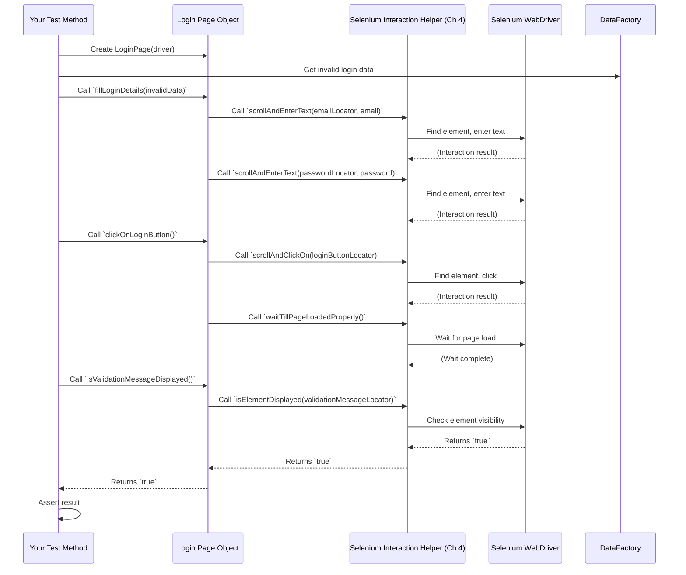

# Chapter 3: Page Object Model (POM)

Welcome back, future automation expert! In [Chapter 1: Environment and Debug Configuration](01_environment_and_debug_configuration_.md), we saw how to easily control our test environment. Then, in [Chapter 2: Test Data Management (Data Objects & Factories)](02_test_data_management__data_objects___factories__.md), we learned how to generate flexible test data on the fly. Now, it's time to learn how to organize our automation code so it's clean, easy to read, and simple to maintain, even when the website you're testing changes!

### The Problem This Solves

Imagine you're building automated tests for a website. Let's say you have a "Login" page. This page has an email field, a password field, and a login button. In your test code, you'd typically write steps like:

```java
// Not good practice - hardcoding everything!
driver.findElement(By.id("email_input")).sendKeys("test@example.com");
driver.findElement(By.id("password_input")).sendKeys("password123");
driver.findElement(By.xpath("//button[text()='Login']")).click();
```

What if, tomorrow, the website developer changes the `id` of the email field from `email_input` to `user_email_field`? Or what if they change the login button's text?

You would have to go through **every single test file** that logs in and update these details. This is like trying to fix a leaky faucet in every room of a large building individually – it's a huge hassle, prone to errors, and makes updates a nightmare! Your test code becomes messy, hard to read, and difficult to maintain.

### The Solution: Page Object Model (POM)

The **Page Object Model (POM)** is like creating an **instruction manual** or a **blueprint** for each unique page (or even a major section) of your website.

Here's the core idea:
1.  **Each web page gets its own class:** For example, `LoginPage.java`, `HomePage.java`, `RegistrationPage.java`.
2.  **Inside each page class:**
    *   You list all the important elements on that page (like text fields, buttons, links). We call these "locators" because they help Selenium *locate* the element.
    *   You define **actions** (methods) you can perform on that page (like `enterEmail()`, `clickLoginButton()`, `fillRegistrationForm()`).

**Think of it this way:**
*   A `LoginPage` class is the "blueprint" for the Login page.
*   It knows where the `emailField` is located.
*   It knows how to `enterEmail` into that field.

This approach makes your tests:
*   **Highly Readable:** Your test cases read like plain English (e.g., `loginPage.enterEmail("...")`).
*   **Maintainable:** If an element's locator changes, you only update it in *one place* (its Page Object class), not in every test!
*   **Reusable:** Once you define actions for a page, you can use them across many different tests.

### Key Concepts in POM

Let's break down the main components of a Page Object.

#### 1. Page Object Class Structure

Each Page Object is typically a Java class. It takes the `WebDriver` (which is Selenium's way of controlling the browser) as a main input so it can interact with the web page.

```java
// File: src/main/java/pageObjectModel/webPageObject/loginPage/LoginPage.java (Simplified)
package pageObjectModel.webPageObject.loginPage;

import org.openqa.selenium.By; // Used to locate elements
import org.openqa.selenium.WebDriver; // To control the browser
import pageObjectModel.webPageObject.WebPageBase; // Our base class for common page features

public class LoginPage extends WebPageBase {
  // This is the special object that lets us interact with Selenium
  // It's inherited from WebPageBase, so we don't need to declare it here
  // protected SeleniumHelper seleniumHelper;

  // This is a special method called a 'constructor'.
  // It's called when you create a new LoginPage object.
  public LoginPage(WebDriver driver) {
    super(driver); // Pass the driver to our base class
  }

  // ... (Locators and Methods will go here) ...
}
```

**Explanation:**
*   `public class LoginPage extends WebPageBase`: This declares our `LoginPage` class. The `extends WebPageBase` part means `LoginPage` inherits common features from `WebPageBase` (we'll explain this soon!).
*   `public LoginPage(WebDriver driver)`: This is the constructor. When you create an instance of `LoginPage` (e.g., `LoginPage loginPage = new LoginPage(driver);`), you pass the `driver` object to it. This `driver` is how Selenium controls the browser.
*   `super(driver);`: This calls the constructor of the `WebPageBase` class, ensuring that common setup is done.

#### 2. Locators (Element Addresses)

Inside your Page Object, you define how to find each element on the page. These are called **Locators**. Selenium provides different ways to locate elements, like by `id`, `name`, `CSS selector`, `XPath`, etc.

```java
// File: src/main/java/pageObjectModel/webPageObject/loginPage/LoginPage.java (Snippet)

  // Locator: How to find the email input field on the page
  private final By emailField = By.id("input-email");

  // Locator: How to find the password input field
  private final By passwordField = By.id("input-password");

  // Locator: How to find the Login button
  private final By loginButton = By.xpath("//input[@value='Login']");
```

**Explanation:**
*   `private final By emailField = By.id("input-email");`: This line declares a locator named `emailField`. It tells Selenium to find an element that has the HTML `id` attribute equal to `"input-email"`.
*   `By.xpath("//input[@value='Login']")`: This uses `XPath`, a powerful way to navigate the structure of a web page and find elements. Here, it finds an `<input>` tag whose `value` attribute is `"Login"`.
*   Using `private final` means these locators cannot be changed after they are set, and they can only be used within this `LoginPage` class, which is good practice.

#### 3. Methods/Actions (Page Interactions)

Once you've defined your locators, you write methods (actions) that interact with these elements. These methods represent the user actions you would perform on that specific page.

```java
// File: src/main/java/pageObjectModel/webPageObject/loginPage/LoginPage.java (Snippet)

  // Method to enter text into the email field
  public void enterEmail(String email) throws InterruptedException {
    seleniumHelper.scrollAndEnterText(emailField, email);
  }

  // Method to enter text into the password field
  public void enterPassword(String password) throws InterruptedException {
    seleniumHelper.scrollAndEnterText(passwordField, password);
  }

  // Method to click the login button
  public void clickOnLoginButton() throws InterruptedException {
    seleniumHelper.scrollAndClickOn(loginButton);
    seleniumHelper.waitTillPageLoadedProperly(); // Wait for the page to load after clicking
  }
```

**Explanation:**
*   `public void enterEmail(String email) throws InterruptedException`: This method takes a `String` (the email) as input.
*   `seleniumHelper.scrollAndEnterText(emailField, email);`: This is where the magic happens! `seleniumHelper` is a special object that contains all our helpful Selenium interaction methods (we'll explore this in [Chapter 4: Selenium Interaction Helper](04_selenium_interaction_helper_.md)). Here, it's used to first scroll to the `emailField` and then type the provided `email` text into it.
*   `seleniumHelper.waitTillPageLoadedProperly();`: After clicking, it's good practice to wait for the next page to fully load.

#### 4. Inheritance and Base Page Objects

Notice that `LoginPage extends WebPageBase`, and `WebPageBase extends BasePageObject`. This is a common pattern in POM frameworks.

*   `BasePageObject`: This is the absolute foundation. It might contain things common to *all* types of pages (web, mobile, etc.), like a `WaitHelper` to make sure elements are ready before interacting with them.

    ```java
    // File: src/main/java/pageObjectModel/BasePageObject.java (Simplified)
    package pageObjectModel;

    import elementHelper.WaitHelper;
    import org.openqa.selenium.WebDriver;

    public class BasePageObject {
      protected WaitHelper wait; // Helps with waiting for elements

      protected BasePageObject(WebDriver driver) {
        wait = new WaitHelper(driver); // Initialize our helper
      }
    }
    ```
    **Explanation:** Every page object needs a `WebDriver`, and often needs to wait for elements. `BasePageObject` sets up `WaitHelper` for all derived pages.

*   `WebPageBase`: This class builds upon `BasePageObject` and adds features specifically for *web* pages. This framework includes `SeleniumHelper` here, which contains many useful methods for interacting with web elements.

    ```java
    // File: src/main/java/pageObjectModel/webPageObject/WebPageBase.java (Simplified)
    package pageObjectModel.webPageObject;

    import elementHelper.web.SeleniumHelper; // Our main interaction helper
    import pageObjectModel.BasePageObject;
    import org.openqa.selenium.By;
    import org.openqa.selenium.WebDriver;

    public class WebPageBase extends BasePageObject {

      protected SeleniumHelper seleniumHelper; // This helper does the actual work!

      protected WebPageBase(WebDriver driver) {
        super(driver); // Pass driver to BasePageObject
        seleniumHelper = new SeleniumHelper(driver); // Initialize SeleniumHelper
      }

      // Example of a common web page method
      public String getPageTitle() throws InterruptedException {
        return seleniumHelper.getPageTitle();
      }
    }
    ```
    **Explanation:** `WebPageBase` is specifically for web pages. It sets up `SeleniumHelper` which all web page objects will use for their interactions. It also defines common web page interactions like `getPageTitle()`.

This inheritance structure means you don't have to rewrite the same setup code or common methods in every single Page Object class. It promotes reusability and keeps your code organized.

### How to Use POM in Your Tests

Now that we know how Page Objects are structured, let's see how you use them in your actual test cases.

Let's imagine a test that tries to log in with invalid credentials.

```java
// Example usage in a hypothetical TestNG test class
import org.openqa.selenium.WebDriver;
import org.testng.annotations.Test;
import pageObjectModel.webPageObject.loginPage.LoginPage; // Import our LoginPage
import dataFactory.loginUserDataFactory.LoginUserDataFactory; // From Chapter 2
import dataObject.loginUser.LoginUserDataObject; // From Chapter 2
// ... other imports for setup like WebDriver initialization

public class LoginTests {

  // Assume 'driver' is initialized before tests run
  private WebDriver driver; // This would be managed by your test base class

  @Test
  public void testInvalidLoginAttempt() throws InterruptedException {
    // 1. Navigate to the login page (setup in your test base)
    // driver.get("http://your-website.com/login");

    // 2. Create an instance of the LoginPage Page Object
    LoginPage loginPage = new LoginPage(driver);

    // 3. Get invalid login data using our Data Factory (from Chapter 2)
    LoginUserDataObject invalidLogin = LoginUserDataFactory.invalidLoginUserData();

    // 4. Use the Page Object methods to perform actions
    loginPage.fillLoginDetails(invalidLogin); // A convenient method that fills both fields
    // This calls:
    // loginPage.enterEmail(invalidLogin.getEmail());
    // loginPage.enterPassword(invalidLogin.getPassword());

    loginPage.clickOnLoginButton();

    // 5. Verify the outcome using Page Object methods
    assert loginPage.isValidationMessageDisplayed(); // Checks if error message is visible
    String actualMessage = loginPage.getValidationMessage();
    System.out.println("Validation Message: " + actualMessage);
    // You would typically use TestNG's Assertions here, e.g., Assert.assertEquals(...)
  }
}
```

**What happens:**
*   `LoginPage loginPage = new LoginPage(driver);`: You create an object representing the Login page. This `loginPage` object now knows all the elements and actions available on that page.
*   `LoginUserDataObject invalidLogin = LoginUserDataFactory.invalidLoginUserData();`: We get our test data using the `Data Factory` from [Chapter 2](02_test_data_management__data_objects___factories__.md).
*   `loginPage.fillLoginDetails(invalidLogin);`: Instead of directly interacting with `driver.findElement(...)`, you simply tell the `loginPage` object to `fillLoginDetails`. This is clean, readable, and hides the technical details of how to interact with the fields.
*   `loginPage.clickOnLoginButton();`: Similarly, to click the login button, you call a method on the `loginPage` object.
*   `loginPage.isValidationMessageDisplayed();`: To verify the outcome, you ask the `loginPage` if the error message is displayed, keeping verification logic within the page object or clearly separated.

### Under the Hood: How POM Works

Let's visualize the flow when your test uses a Page Object:



**Step-by-step walkthrough:**

1.  **Test Starts:** Your `@Test` method starts executing.
2.  **Page Object Instantiation:** You create an instance of the `LoginPage` by passing your `WebDriver` object to its constructor. This sets up the `LoginPage` with the `seleniumHelper` (which actually talks to Selenium).
3.  **Data Retrieval:** You get the necessary test data from a `Data Factory` (as learned in [Chapter 2](02_test_data_management__data_objects___factories__.md)).
4.  **Action Request:** Your test calls a method on the `LoginPage` object, for example, `loginPage.fillLoginDetails()`.
5.  **Internal Call to Helper:** The `fillLoginDetails` method in the `LoginPage` then internally calls `seleniumHelper.scrollAndEnterText()` for the email and password fields.
6.  **Selenium Interaction:** The `seleniumHelper` (our abstraction over raw Selenium calls) takes the locator (`emailField`) and the data (`email`) and uses the `WebDriver` to find the element on the page and perform the `sendKeys()` action. This helper also handles waits, error handling, and the debug highlighting feature from [Chapter 1](01_environment_and_debug_configuration_.md).
7.  **Click and Wait:** When `clickOnLoginButton()` is called, `seleniumHelper` performs the click, and then `waitTillPageLoadedProperly()` ensures the application has responded and the new page (or updated view) is ready before the test proceeds.
8.  **Verification Request:** For verification, your test calls `loginPage.isValidationMessageDisplayed()`.
9.  **Helper-Powered Verification:** The `LoginPage` then uses `seleniumHelper.isElementDisplayed()` to check if the validation message element is visible on the page.
10. **Result to Test:** The result (`true`/`false`) is returned through the Page Object back to your test method, where you can make assertions.

### Code Spotlight

Let's look at the actual code snippets that power this.

**1. `BasePageObject.java` (The Root Foundation):**

```java
// File: src/main/java/pageObjectModel/BasePageObject.java
package pageObjectModel;

import elementHelper.WaitHelper; // Our helper for waiting
import org.openqa.selenium.WebDriver;

public class BasePageObject {
  protected WaitHelper wait; // Accessible to all derived pages

  protected BasePageObject(WebDriver driver) {
    wait = new WaitHelper(driver); // Every page object gets a wait helper
  }
}
```
**Explanation:** This provides a `WaitHelper` to any page object that inherits from it. This is useful for making sure elements are loaded and ready before interacting with them, preventing "element not found" errors due to timing issues.

**2. `WebPageBase.java` (The Web-Specific Foundation):**

```java
// File: src/main/java/pageObjectModel/webPageObject/WebPageBase.java
package pageObjectModel.webPageObject;

import elementHelper.web.SeleniumHelper; // Our core Selenium interaction class
import pageObjectModel.BasePageObject;
import org.openqa.selenium.By; // Used for locators
import org.openqa.selenium.WebDriver;

public class WebPageBase extends BasePageObject {

  protected SeleniumHelper seleniumHelper; // The helper that performs actions

  protected WebPageBase(WebDriver driver) {
    super(driver); // Initialize BasePageObject's features
    seleniumHelper = new SeleniumHelper(driver); // Initialize the web-specific helper
  }

  // Example: a common locator and method for all web pages
  private final By logoLink = By.cssSelector("div#logo a[href*='home']");

  public void clickOnLogoLink() throws InterruptedException {
    seleniumHelper.clickOnElementUsingJavaScript(logoLink);
    seleniumHelper.waitTillPageLoadedProperly();
  }
}
```
**Explanation:** This class is specifically for web pages. It initializes `SeleniumHelper` (which we'll discuss in [Chapter 4](04_selenium_interaction_helper_.md)) and includes methods common to almost any web page, like clicking a logo to return to the home page.

**3. `LoginPage.java` (A Specific Page Object):**

```java
// File: src/main/java/pageObjectModel/webPageObject/loginPage/LoginPage.java
package pageObjectModel.webPageObject.loginPage;

import dataObject.loginUser.LoginUserDataObject; // To use our data objects
import pageObjectModel.webPageObject.WebPageBase;
import org.openqa.selenium.By;
import org.openqa.selenium.WebDriver;

public class LoginPage extends WebPageBase {
  public LoginPage(WebDriver driver) {
    super(driver);
  }

  // Locators for elements on the login page
  private final By emailField = By.id("input-email");
  private final By passwordField = By.id("input-password");
  private final By loginButton = By.xpath("//input[@value='Login']");
  private final By validationMessage = By.xpath("//div[contains(@class,'alert-danger')]");

  // Method to enter email
  public void enterEmail(String email) throws InterruptedException {
    seleniumHelper.scrollAndEnterText(emailField, email);
  }

  // Method to enter password
  public void enterPassword(String password) throws InterruptedException {
    seleniumHelper.scrollAndEnterText(passwordField, password);
  }

  // Method to click login button
  public void clickOnLoginButton() throws InterruptedException {
    seleniumHelper.scrollAndClickOn(loginButton);
    seleniumHelper.waitTillPageLoadedProperly();
  }

  // Method to check if validation message is displayed
  public boolean isValidationMessageDisplayed() {
    return seleniumHelper.isElementDisplayed(validationMessage);
  }

  // Method to fill both email and password using a Data Object (from Chapter 2)
  public void fillLoginDetails(LoginUserDataObject loginDetails) throws InterruptedException {
    enterEmail(loginDetails.getEmail());
    enterPassword(loginDetails.getPassword());
  }
}
```
**Explanation:**
*   This is a complete example of a Page Object. It extends `WebPageBase` to get access to `seleniumHelper`.
*   It defines `By` locators for specific elements on the Login page.
*   It provides methods like `enterEmail`, `enterPassword`, `clickOnLoginButton` that clearly describe actions a user would take.
*   The `fillLoginDetails` method demonstrates how Page Objects can work seamlessly with the `Data Objects` from [Chapter 2](02_test_data_management__data_objects___factories__.md), accepting a `LoginUserDataObject` and using its data to fill the fields.

### Conclusion

You've now grasped the fundamental concept of the Page Object Model! By representing each web page as a separate class, you've learned how to define its elements (locators) and actions (methods) in a structured way. This approach makes your UI automation tests incredibly robust, readable, and maintainable. If the website's design changes, you only need to update the relevant Page Object, saving you a lot of time and effort.

Next, we'll dive deeper into the `SeleniumHelper` – the powerful helper class that your Page Objects use to perform all the actual interactions with the web elements on the page.

[Next Chapter: Selenium Interaction Helper](04_selenium_interaction_helper_.md)

---

Generated by [AI Codebase Knowledge Builder](https://github.com/The-Pocket/Tutorial-Codebase-Knowledge)