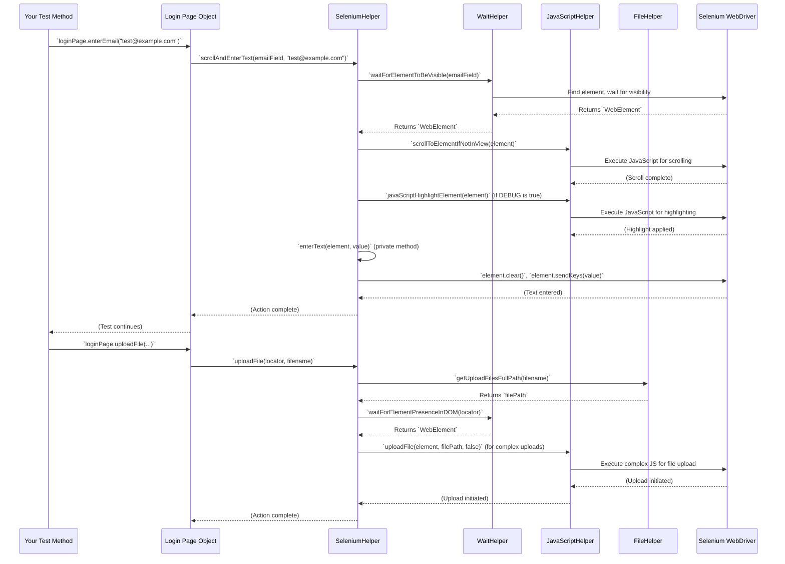

# Chapter 4: Selenium Interaction Helper

Welcome back! In [Chapter 3: Page Object Model (POM)](03_page_object_model__pom__.md), we learned how to organize our test code by creating blueprints for each web page. We saw how a `LoginPage` class can have methods like `enterEmail()` or `clickOnLoginButton()`. But what actually happens when you call `loginPage.enterEmail("...")`? How does the framework ensure these actions are reliable and don't fail unexpectedly?

### The Problem This Solves

Imagine you're trying to click a button on a web page using basic Selenium. You might write:

```java
// Raw Selenium approach - not recommended!
WebElement button = driver.findElement(By.id("myButton"));
button.click();
```

This looks simple, right? But in the real world of web applications, things aren't always so straightforward:
*   **Timing Issues:** What if the button hasn't fully loaded yet? Or it's briefly hidden by an animation? Your `click()` command might fail because the element isn't "ready."
*   **Flakiness:** Sometimes, a test passes, and sometimes it fails on the exact same step, for no obvious reason. This is called "flakiness" and is often due to subtle timing issues or temporary browser glitches.
*   **Complex Actions:** What if you need to scroll to an element first? Or highlight it for debugging? Or upload a file? Doing all this with raw Selenium commands can make your tests long, complex, and hard to read.
*   **Repetitive Code:** You'd end up writing the same "wait for element," "handle stale element," "scroll into view" logic over and over again in every test.

This is where the **Selenium Interaction Helper** comes in!

### The Solution: Your Smart Interaction Assistant

The `Selenium Interaction Helper` (specifically the `SeleniumHelper` class) is like your **smart assistant** for interacting with web elements. Instead of directly telling Selenium to "click that button," you tell your assistant, "please click this button *reliably*."

It's an enhanced wrapper around basic Selenium commands, providing robust and concise methods for common web interactions. It knows how to:
*   **Wait Smartly:** It automatically waits for elements to be visible, clickable, or present before interacting with them. This significantly reduces test flakiness.
*   **Handle Tricky Situations:** It can handle unexpected temporary issues, like an element becoming "stale" (meaning Selenium lost its reference to it).
*   **Perform Advanced Actions:** It includes methods for scrolling, using JavaScript to interact with elements, and even handling file uploads and downloads.
*   **Integrate Debugging:** Remember the `DEBUG` mode from [Chapter 1: Environment and Debug Configuration](01_environment_and_debug_configuration_.md)? `SeleniumHelper` automatically highlights elements when debug mode is on, making it incredibly easy to see what your test is doing!

This helper makes your test scripts more robust and concise, ensuring your tests are more reliable and easier to read.

### How to Use the Selenium Interaction Helper

In [Chapter 3: Page Object Model (POM)](03_page_object_model__pom__.md), we saw that your Page Objects (like `LoginPage`) don't directly use `driver.findElement()`. Instead, they use a `seleniumHelper` object.

Let's revisit our `LoginPage` example and see how it uses `SeleniumHelper`:

```java
// File: src/main/java/pageObjectModel/webPageObject/loginPage/LoginPage.java (Snippet)

import pageObjectModel.webPageObject.WebPageBase; // Inherits SeleniumHelper from here
import org.openqa.selenium.By;
import org.openqa.selenium.WebDriver;

public class LoginPage extends WebPageBase {
  // We don't declare seleniumHelper here, it's inherited from WebPageBase!

  public LoginPage(WebDriver driver) {
    super(driver); // Calls WebPageBase's constructor, which sets up seleniumHelper
  }

  private final By emailField = By.id("input-email");
  private final By passwordField = By.id("input-password");
  private final By loginButton = By.xpath("//input[@value='Login']");

  // Method to enter text into the email field
  public void enterEmail(String email) throws InterruptedException {
    // Calling the smart assistant!
    seleniumHelper.scrollAndEnterText(emailField, email);
  }

  // Method to click the login button
  public void clickOnLoginButton() throws InterruptedException {
    // Calling the smart assistant!
    seleniumHelper.scrollAndClickOn(loginButton);
    seleniumHelper.waitTillPageLoadedProperly(); // Wait for navigation to complete
  }

  // Method to check if a message is displayed
  public boolean isValidationMessageDisplayed() {
    By validationMessage = By.xpath("//div[contains(@class,'alert-danger')]");
    return seleniumHelper.isElementDisplayed(validationMessage);
  }
}
```

**Explanation:**
*   Notice how `LoginPage` doesn't directly create `SeleniumHelper`. Instead, it `extends WebPageBase`. `WebPageBase` (which itself extends `BasePageObject`) is where the `seleniumHelper` object is created and made available to all web Page Objects. This is part of the framework's design to keep things organized.
*   **`seleniumHelper.scrollAndEnterText(emailField, email);`**: This single line replaces multiple raw Selenium commands. Behind the scenes, `SeleniumHelper` will:
    1.  Wait for the `emailField` to be visible.
    2.  Scroll the page so the `emailField` is in view.
    3.  (If `DEBUG` mode is on) Temporarily highlight the `emailField` in red.
    4.  Clear any existing text in the `emailField`.
    5.  Type the `email` value into the `emailField`.
*   **`seleniumHelper.scrollAndClickOn(loginButton);`**: Similarly, this method handles:
    1.  Waiting for the `loginButton` to be clickable.
    2.  Waiting for it to be enabled.
    3.  Scrolling to it if needed.
    4.  (If `DEBUG` mode is on) Highlighting it.
    5.  Clicking it, and *retrying* if a `StaleElementReferenceException` occurs (a common Selenium headache!).
*   **`seleniumHelper.isElementDisplayed(validationMessage);`**: This method also includes waiting for the element to be visible before checking its display status, providing a more reliable check than a simple `element.isDisplayed()`.

### More Examples of SeleniumHelper in Action

`SeleniumHelper` provides many other robust methods:

**1. Selecting Options from Dropdowns:**

```java
// Selects the option with visible text "Option 2"
seleniumHelper.selectOptionByText(By.id("myDropdown"), "Option 2");

// Selects the option with value "value1"
seleniumHelper.selectOptionByValue(By.cssSelector(".country-selector"), "value1");

// Selects the 3rd option (index 2, as counting starts from 0)
seleniumHelper.selectOptionByIndex(By.name("productType"), 2);
```
**Explanation:** These methods handle waiting for the dropdown to be ready and then use Selenium's `Select` class to choose an option, making dropdown interactions easy and reliable.

**2. File Uploads:**

```java
// Uploads a single file
// "myFileInput" is the locator for the file input element (<input type="file">)
// "document.pdf" is the name of the file in your project's `uploadFiles` directory.
seleniumHelper.uploadFile(By.id("myFileInput"), "document.pdf");

// Uploads multiple files (if the input field supports it)
List<String> filesToUpload = List.of("image1.jpg", "image2.png");
seleniumHelper.uploadFile(By.id("multiFileInput"), filesToUpload);
```
**Explanation:** `SeleniumHelper` handles the complexities of finding the file input element and sending the correct path to it. It also uses JavaScript (via `JavaScriptHelper`) for cases where a simple `sendKeys` might not work (e.g., custom file upload components). It uses `FileHelper` (behind the scenes) to get the correct path.

**3. File Downloads and Verification:**

```java
// Initiates a download by clicking a link and verifies the file exists
boolean fileDownloaded = seleniumHelper.initiateDownloadAndVerifyBuilder()
    .locator(By.linkText("Download Report"))
    .fileName("report.xlsx")
    .downloadTimeout(30) // Wait up to 30 seconds for download
    .build();

if (fileDownloaded) {
    System.out.println("Report downloaded successfully!");
} else {
    System.out.println("Report download failed!");
}
```
**Explanation:** This powerful method first clicks the download link, then intelligently waits for the file to appear in the designated download folder (which the framework configures for you). It returns `true` if the file is found within the specified time, handling common download challenges.

### Under the Hood: How SeleniumHelper Works

The `SeleniumHelper` acts as a central coordinator, delegating specific tasks to other specialized helper classes. This modular design keeps the code clean and manageable.



**Step-by-step walkthrough:**

1.  **Test to Page Object:** Your test calls a method on a Page Object (e.g., `loginPage.enterEmail(...)`).
2.  **Page Object to SeleniumHelper:** The Page Object then calls the appropriate method on its `seleniumHelper` instance (e.g., `seleniumHelper.scrollAndEnterText(...)`).
3.  **SeleniumHelper to WaitHelper:** `SeleniumHelper` immediately passes the element locator to `WaitHelper`. `WaitHelper` uses Selenium's powerful `WebDriverWait` to ensure the element is in the desired state (e.g., visible, clickable) before any interaction attempts. This is crucial for stability.
4.  **SeleniumHelper to JavaScriptHelper:** If scrolling or visual debugging (`DEBUG` mode from Chapter 1) is needed, `SeleniumHelper` calls `JavaScriptHelper`. `JavaScriptHelper` then executes custom JavaScript code directly in the browser. This is very powerful for scenarios where standard Selenium commands might not work well (like precise scrolling or dynamic element interactions).
5.  **SeleniumHelper to FileHelper:** For file uploads or downloads, `SeleniumHelper` interacts with `FileHelper`. `FileHelper` manages file paths, checks for file existence in the download directory, and cleans up old files.
6.  **SeleniumHelper to WebDriver:** Finally, after all preconditions are met (element is ready, in view, etc.), `SeleniumHelper` sends the actual Selenium command (like `sendKeys()` or `click()`) to the `WebDriver`. It also includes retry logic for common errors like `StaleElementReferenceException`.

This layered approach makes `SeleniumHelper` extremely robust, handling many common automation challenges behind the scenes, so your Page Objects can focus on high-level user actions.

### Code Spotlight

Let's look at some simplified snippets from the core helper classes to understand how this reliability is built.

**1. `SeleniumHelper.java` (The Orchestrator):**

```java
// File: src/main/java/elementHelper/web/SeleniumHelper.java (Simplified)
package elementHelper.web;

import elementHelper.WaitHelper; // Imports WaitHelper
import io.github.cdimascio.dotenv.Dotenv;
import org.openqa.selenium.By;
import org.openqa.selenium.StaleElementReferenceException;
import org.openqa.selenium.WebDriver;
import org.openqa.selenium.WebElement;

public class SeleniumHelper {

  private final WaitHelper waitHelper;
  private final JavaScriptHelper jsHelper; // Imports JavaScriptHelper
  private static final boolean IS_DEBUG = Boolean.parseBoolean(Dotenv.configure().load().get("DEBUG")); // Gets DEBUG flag

  public SeleniumHelper(WebDriver driver) {
    this.driver = driver;
    waitHelper = new WaitHelper(driver); // Initialize WaitHelper
    jsHelper = new JavaScriptHelper(driver); // Initialize JavaScriptHelper
  }

  // Example: scroll, highlight, and enter text reliably
  public void scrollAndEnterText(By by, String value) throws InterruptedException {
    // 1. Wait for element to be visible using WaitHelper
    var element = waitHelper.waitForElementToBeVisible(by);
    // 2. Scroll element into view using JavaScriptHelper
    jsHelper.scrollToElementIfNotInView(element);
    // 3. Highlight element for debugging (if DEBUG is true)
    if (IS_DEBUG) jsHelper.javaScriptHighlightElement(element);
    // 4. Perform the actual text entry
    enterText(element, value);
  }

  // Private method to handle text entry with enablement check
  private void enterText(WebElement element, String value) throws InterruptedException {
    var enabledElement = waitTillElementIsEnable(element); // Ensure element is enabled
    enabledElement.clear();
    enabledElement.sendKeys(value);
  }

  // Private method to click reliably, handling stale elements
  private void clickOnElement(WebElement element) {
    int maxAttempts = 10;
    boolean isStale;
    do {
      try {
        element.click();
        isStale = false; // Success! No stale element
      } catch (StaleElementReferenceException e) {
        isStale = true; // Element became stale, retry!
      } catch (Exception e) {
        e.printStackTrace(); // Other errors, consider it stale for retry
        isStale = true;
      }
      maxAttempts--;
    } while (maxAttempts > 0 && isStale);
  }
}
```
**Explanation:** `SeleniumHelper` is the central point. It creates instances of `WaitHelper` and `JavaScriptHelper` to delegate tasks. Its methods like `scrollAndEnterText` combine waiting, scrolling, debugging highlights, and robust element interaction. The `clickOnElement` method is a great example of handling common Selenium pitfalls like `StaleElementReferenceException` with a retry mechanism.

**2. `WaitHelper.java` (The Patient One):**

```java
// File: src/main/java/elementHelper/WaitHelper.java (Simplified)
package elementHelper;

import org.openqa.selenium.By;
import org.openqa.selenium.WebDriver;
import org.openqa.selenium.WebElement;
import org.openqa.selenium.support.ui.ExpectedConditions;
import org.openqa.selenium.support.ui.WebDriverWait;
import java.time.Duration;

public class WaitHelper {

  private final WebDriver driver;

  public WaitHelper(WebDriver driver) {
    this.driver = driver;
  }

  private WebDriverWait getWebDriverWait() {
    return new WebDriverWait(driver, Duration.ofSeconds(15)); // Default wait time
  }

  // Waits for an element to be visible on the page
  public WebElement waitForElementToBeVisible(By locator) {
    return getWebDriverWait().until(ExpectedConditions.visibilityOfElementLocated(locator));
  }

  // Waits for an element to be clickable
  public WebElement waitForElementToBeClickable(By locator) {
    return getWebDriverWait().until(ExpectedConditions.elementToBeClickable(locator));
  }
  // ... many other wait conditions (presence, invisibility, text change, etc.) ...
}
```
**Explanation:** `WaitHelper` wraps Selenium's `WebDriverWait` and `ExpectedConditions`. Instead of you writing `new WebDriverWait(driver, Duration.ofSeconds(10)).until(...)` every time, `SeleniumHelper` just tells `WaitHelper` to `waitForElementToBeVisible`. This keeps wait logic centralized and easy to manage.

**3. `JavaScriptHelper.java` (The Web Magician):**

```java
// File: src/main/java/elementHelper/web/JavaScriptHelper.java (Simplified)
package elementHelper.web;

import elementHelper.WaitHelper;
import org.openqa.selenium.JavascriptExecutor;
import org.openqa.selenium.WebDriver;
import org.openqa.selenium.WebElement;

public class JavaScriptHelper {

  private final JavascriptExecutor js;
  private final WaitHelper waitHelper; // Can use wait helper too

  public JavaScriptHelper(WebDriver driver) {
    js = (JavascriptExecutor) driver; // Cast WebDriver to JavascriptExecutor
    waitHelper = new WaitHelper(driver);
  }

  // Scrolls element into the center of the view
  void scrollToElementCenter(WebElement element) {
    var jsQuery = """
    var elementRect = arguments[0].getBoundingClientRect();
    var absoluteElementTop = elementRect.top + window.pageYOffset;
    var middle = absoluteElementTop - (window.innerHeight / 2);
    window.scrollTo(0, middle);
    """;
    js.executeScript(jsQuery, element);
  }

  // Highlights an element with a red border for debugging
  void javaScriptHighlightElement(WebElement element) throws InterruptedException {
    js.executeScript("arguments[0].style.border='3px solid red'", element);
    waitHelper.hardWait(2); // Short pause to see the highlight
  }

  // Simulates a click using JavaScript (useful when normal click doesn't work)
  void javaScriptClickOn(WebElement element) {
    js.executeScript("arguments[0].click();", element);
  }

  // Complex method for file upload using JavaScript (for non-standard file inputs)
  public void uploadFile(WebElement element, String filePath, boolean isMultiple) {
    // ... complex JavaScript code ...
    var fileInput = (WebElement) js.executeScript("...", element, 0, 0);
    if (fileInput != null) fileInput.sendKeys(filePath); // Send path to the created input
  }
}
```
**Explanation:** `JavaScriptHelper` uses `JavascriptExecutor` to run JavaScript directly on the web page. This is incredibly flexible for actions that Selenium's built-in commands struggle with, like precise scrolling, dynamic styling (for `DEBUG` mode), or interacting with complex custom components (like advanced file upload widgets).

**4. `FileHelper.java` (The File Manager):**

```java
// File: src/main/java/elementHelper/web/FileHelper.java (Simplified)
package elementHelper.web;

import com.selenium.testng.elite.utils.PathHelper; // Helps get file paths
import java.io.File;
import java.time.Duration;
import java.util.Collection;
import java.util.function.Function;
import org.apache.commons.io.FileUtils;
import org.apache.commons.lang3.tuple.Pair;
import org.openqa.selenium.support.ui.FluentWait;

public class FileHelper {

  // Checks if a file exists in the download folder within a timeout
  static Pair<Boolean, String> isFileExists(String fileName, int timeInSeconds) {
    File dir = new File(PathHelper.getDownloadFolderPath()); // Get download directory

    FluentWait<File> wait = new FluentWait<>(dir)
        .withTimeout(Duration.ofSeconds(timeInSeconds))
        .pollingEvery(Duration.ofSeconds(2)) // Check every 2 seconds
        .ignoring(Exception.class);

    Function<File, Boolean> checkForFile = fileDir -> {
      var files = fileDir.listFiles();
      if (files == null) return false;
      for (File file : files) {
        if (file.getName().equals(fileName) && file.length() > 0) { // Check name and size
          return true;
        }
      }
      return false;
    };
    var fileExists = false;
    try {
      fileExists = wait.until(checkForFile);
    } catch (Exception e) { /* ... */ }
    // ... returns a Pair with status and list of files in folder ...
    return Pair.of(fileExists, "Files: ...");
  }

  // Deletes all files in the download folder (except .gitkeep)
  public static void deleteAllFiles() {
    var dir = new File(PathHelper.getDownloadFolderPath());
    FileUtils.listFiles(dir, null, true).stream()
        .filter(file -> !file.getName().equals(".gitkeep"))
        .forEach(file -> {
          try { FileUtils.forceDelete(file); } catch (Exception e) { /* ... */ }
        });
  }
  // ... other file operations like getUploadFilesFullPath ...
}
```
**Explanation:** `FileHelper` manages local file system interactions, particularly around download and upload directories. It uses `FluentWait` to patiently wait for downloaded files to appear and helper libraries like `Apache Commons IO` for file operations. This separates file system concerns from web element interactions.

### Conclusion

You've now seen how the `Selenium Interaction Helper` (the `SeleniumHelper` class) is your robust toolkit for reliable web element interactions. It acts as a smart layer on top of basic Selenium commands, incorporating explicit waits, JavaScript tricks, and file operations to make your tests stable, readable, and less prone to flakiness. By delegating to specialized helpers like `WaitHelper`, `JavaScriptHelper`, and `FileHelper`, it ensures a clean and powerful automation experience.

Next, we'll explore how this framework handles [Reporting and Notification](05_reporting_and_notification_.md) to keep you informed about your test results.

[Next Chapter: Reporting and Notification](05_reporting_and_notification_.md)

---

Generated by [AI Codebase Knowledge Builder](https://github.com/The-Pocket/Tutorial-Codebase-Knowledge)