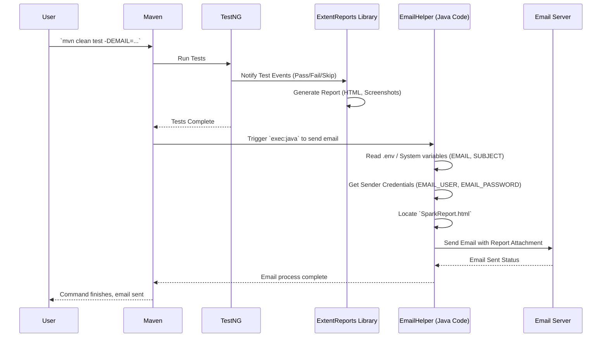

# Chapter 5: Reporting and Notification

Welcome back, automation adventurer! In our previous chapters, we've built a solid foundation: in [Chapter 1: Environment and Debug Configuration](01_environment_and_debug_configuration_.md), we learned to set up our test environment; in [Chapter 2: Test Data Management (Data Objects & Factories)](02_test_data_management__data_objects___factories__.md), we mastered handling test data; in [Chapter 3: Page Object Model (POM)](03_page_object_model__pom_.md), we structured our interactions with web pages; and in [Chapter 4: Selenium Interaction Helper](04_selenium_interaction_helper_.md), we made those interactions super reliable.

Now, imagine your tests have run, and you've successfully automated many scenarios. That's great! But how do you know what happened? Did everything pass? Why did a test fail? How do you share these important updates with your team, especially when tests run automatically on a server?

### The Problem This Solves

Without a proper reporting system, you'd be stuck:
*   **No Clear Overview:** You'd just see a "build passed" or "build failed" message, but no details about individual tests.
*   **Troubleshooting Headaches:** If a test fails, you'd have to dig through raw log files to understand what went wrong, which can be like finding a needle in a haystack.
*   **Manual Communication:** You'd have to manually check test results and then tell your team, "Hey, the tests passed today!" or "Oops, a few failed, I'll send details." This takes time and can be forgotten.

This is where the **Reporting and Notification** system comes in!

### The Solution: Your "Results Delivery Service"

This framework provides a fantastic "results delivery service" that ensures you and your team get clear, detailed updates on test execution status automatically. It does this through two main parts:

1.  **Rich, Interactive Reports (ExtentReports):** It automatically generates beautiful, easy-to-read HTML reports that summarize everything about your test runs. Think of it like a personalized, interactive newspaper for your test results!
2.  **Automated Email Notification:** It can automatically send these reports via email to specified recipients after each test run. This means no more manual sharing – everyone involved gets an update as soon as the tests are done.

Let's dive into how these two powerful features work.

### Concept 1: ExtentReports - Your Interactive Test Newspaper

ExtentReports is a popular library that helps you create professional and interactive HTML reports. These reports are much more than just a list of pass/fail. They provide:

*   **Overall Summary:** A dashboard showing how many tests passed, failed, or were skipped.
*   **Detailed Test Steps:** For each test, you can see every action taken, logs, and even screenshots!
*   **Failure Analysis:** If a test fails, the report includes the exact error message and, most importantly, a **screenshot** taken at the moment of failure. This is incredibly helpful for quickly understanding what went wrong.

**Why it's useful:** Instead of guessing why a test failed, you can open the report, click on the failed test, see its steps, and immediately look at the screenshot. It's like having "eyes" on your automated tests!

### Concept 2: Automated Email Notification - Your Test Mailman

After generating the detailed Extent Report, the framework takes it a step further. It uses a special tool (a custom Maven plugin) to automatically send this report to you and your team via email.

**Why it's useful:**
*   **Instant Updates:** You get results as soon as tests finish, even if you're not actively watching the test run.
*   **Collaboration:** Everyone on the team stays informed without any extra effort.
*   **History:** You have a record of past test runs in your inbox.

### How to Use Reporting and Notification

The best part about this framework is that **most of the reporting and notification happens automatically** when you run your tests!

#### 1. Running Tests and Generating Reports

You don't need to do anything special in your test code to generate the Extent Report. When you run your tests using the standard Maven command, the framework automatically hooks into TestNG (our test runner) and starts building the report in the background.

```sh
mvn clean test -DsuiteXmlFile="testng.xml"
```
**What happens:**
*   Your tests execute.
*   As each test runs, details like test steps, pass/fail status, and logs are automatically captured by the framework's internal reporting setup.
*   If a test fails, a screenshot is automatically taken and embedded directly into the report, along with the error message.
*   Once all tests are done, a comprehensive HTML report named `SparkReport.html` is generated.

#### 2. Accessing Your Report

After the test run completes, you can find your shiny new report at:
`target/html-report/SparkReport.html`

Simply open this file in any web browser to view your detailed test results.

**Pro Tip: Auto-Opening the Report!**

The framework can even automatically open the report in your browser after the tests complete. Just set `WANT_TO_OPEN_REPORT=true` in your `.env` file (remember [Chapter 1](01_environment_and_debug_configuration_.md) for `.env` files!).

**Example `.env` file content:**

```env
BROWSER=chrome
PLATFORM=web
HEADLESS=false
DEBUG=true
WANT_TO_OPEN_REPORT=true # Add this line!
```

#### 3. Configuring Automated Email Notification

To get the report emailed to you, you'll primarily configure this through environment variables or command-line arguments when you run your tests.

*   **`EMAIL`**: The email address(es) where the report should be sent.
*   **`SUBJECT`**: The subject line for the email.

**Example: Sending reports via email from your local machine:**

```sh
# Run tests and send the report to "your.email@example.com"
mvn clean test -DsuiteXmlFile="testng.xml" -DEMAIL="your.email@example.com" -DSUBJECT="Daily Automation Report"
```

**What happens:**
*   After the tests run and the `SparkReport.html` is generated, the framework triggers a special command (a custom Maven `exec:java` plugin, as mentioned in the `README.md`) to send the email.
*   The `emailHelper.sendEmailWithAttachment` component is activated, reads your specified `EMAIL` and `SUBJECT`, grabs the `SparkReport.html` file, and sends it.

**Important for CI/CD (like GitHub Actions):**

When running tests on a server (like GitHub Actions, as seen in the `README.md`), you'll also need to provide the sender's email credentials. For security, these are typically stored as **secrets** (e.g., `SENDER_EMAIL` and `SENDER_APP_PASSWORD` in GitHub Actions).

```yaml
# Snippet from a GitHub Actions workflow (simplified)
- name: Send result via email
  if: always() # Send email even if tests fail
  run: |
    export EMAIL=${{ github.event.inputs.Email }} # Get recipient email from workflow input
    export SUBJECT="Complete Execution for ${{ github.event.inputs.Environment }} on ${{ github.event.inputs.Browser }}"
    mvn exec:java # This triggers the email sending logic
  env:
    EMAIL_USER: ${{ secrets.SENDER_EMAIL }} # Your sender email (GitHub Secret)
    EMAIL_PASSWORD: ${{ secrets.SENDER_APP_PASSWORD }} # Your sender app password (GitHub Secret)
```
**Explanation:** In CI/CD, instead of putting your email password directly in the `.env` file (which is insecure), you use "secrets" configured in your CI/CD platform. The `mvn exec:java` command then runs a specific Java class responsible for sending the email.

### Under the Hood: The Results Delivery Flow

Let's visualize how everything comes together to deliver your test results:



**Step-by-step walkthrough:**

1.  **You Start the Tests:** You initiate the test run using a Maven command.
2.  **TestNG Executes:** Maven invokes TestNG, which starts running your automated test cases.
3.  **ExtentReports Listens:** As TestNG runs each test, a special listener (integrated into the framework) captures all the events: when a test starts, what steps are logged, if it passes or fails, and if a screenshot needs to be taken. This data is fed into the ExtentReports library.
4.  **Report Generation:** After all tests are finished, the ExtentReports library uses the collected data to compile and generate the `SparkReport.html` file in your `target/html-report` directory.
5.  **Email Trigger:** Maven, through a configured plugin (like `exec:java`), then executes the `emailHelper.sendEmailWithAttachment` Java code.
6.  **EmailHelper Prepares:** This Java code reads the recipient's email (`EMAIL`) and the subject (`SUBJECT`) from the environment variables (either from `.env` or command line, or CI/CD secrets). It also fetches the sender's credentials.
7.  **EmailHelper Attaches Report:** It then locates the `SparkReport.html` file and prepares it as an attachment.
8.  **Email Sent:** Finally, the `EmailHelper` connects to an email server (like Gmail's SMTP server) using the sender's credentials and sends the email with the attached report to the specified recipient(s).
9.  **Completion:** The Maven command finishes, and you'll find the report in your inbox!

### Code Spotlight: Sending the Email

The core logic for sending the email is handled by the `sendEmailWithAttachment.java` class. Let's look at some key parts:

**1. Reading Configuration and Report Content:**

```java
// File: src/main/java/emailHelper/sendEmailWithAttachment.java (Simplified)
package emailHelper;

import com.selenium.testng.elite.utils.PathHelper; // Helps find report path
import io.github.cdimascio.dotenv.Dotenv; // To read .env variables
import java.io.*; // For reading files

public class sendEmailWithAttachment {

  public static void main(String[] args) throws IOException {
    // Load variables from .env file
    Dotenv dotenv = Dotenv.load();
    String emailSendTo = dotenv.get("EMAIL");     // Recipient email
    String subject = dotenv.get("SUBJECT");       // Email subject

    // Get sender credentials from system environment (GitHub Actions secrets)
    String senderEmail = System.getenv("EMAIL_USER");
    String senderAPPPassword = System.getenv("EMAIL_PASSWORD");

    // Build the email body (reading some summary from a text file)
    StringBuilder content = readTextFile(PathHelper.getTestResultTextFilePath());
    StringBuilder failedList = readFailedTextCaseListFile(PathHelper.getListOfFailedTestCasesFile());

    String body = """
        Hello Team,
        Please find attached the report...
        """ + content + "\n\n" + failedList + "...";

    // ... (SMTP session setup and sending logic follows) ...
  }

  // Helper to read simple text summary files
  private static StringBuilder readTextFile(String filePath) { /* ... */ return new StringBuilder(); }
  private static StringBuilder readFailedTextCaseListFile(String filePath) { /* ... */ return new StringBuilder(); }
}
```
**Explanation:**
*   `Dotenv.load().get("EMAIL")`: This retrieves the recipient email from your `.env` file or command-line arguments.
*   `System.getenv("EMAIL_USER")`: This is how it securely gets the sender's email from system environment variables, which is how GitHub Actions passes secrets.
*   `PathHelper.getTestResultTextFilePath()`: These `PathHelper` methods are used to find the automatically generated text summaries and the main HTML report file.
*   The `body` is constructed using various parts, including the summary text files and a general message.

**2. Attaching the Report and Sending the Email:**

```java
// File: src/main/java/emailHelper/sendEmailWithAttachment.java (Simplified)
// ... (imports and main method start from previous snippet) ...

    // SMTP server properties setup (standard email configuration)
    // Properties props = new Properties(); ...

    // Get email session with authentication
    // Session session = Session.getInstance(props, new Authenticator() { ... });

    try {
      // Create the email message
      // Message message = new MimeMessage(session); ...
      // message.setSubject(subject); ...

      // Create the text part of the email
      MimeBodyPart messageBodyPart = new MimeBodyPart();
      messageBodyPart.setText(body);

      // Create a multi-part message (to hold text and attachments)
      Multipart multipart = new MimeMultipart();
      multipart.addBodyPart(messageBodyPart);

      // Create the attachment part
      MimeBodyPart attachmentBodyPart = new MimeBodyPart();
      // Attach the Extent Report HTML file!
      attachmentBodyPart.attachFile(new File(PathHelper.getPathForReport()));
      multipart.addBodyPart(attachmentBodyPart);

      // Set the full content of the message
      message.setContent(multipart);

      // Send the email!
      Transport.send(message);
      System.out.println("Email sent successfully!");
    } catch (Exception e) {
      System.out.println("Failed to send email: " + e.getMessage());
      e.printStackTrace();
    }
  }
}
```
**Explanation:**
*   `MimeBodyPart messageBodyPart.setText(body)`: This sets the main text content of your email.
*   `MimeBodyPart attachmentBodyPart.attachFile(new File(PathHelper.getPathForReport()))`: This is the crucial line! It tells the email system to find your `SparkReport.html` file (using `PathHelper`) and attach it to the email.
*   `Multipart multipart.addBodyPart(...)`: An email with attachments needs to be a "multipart" message, meaning it has different sections (one for text, one for each attachment).
*   `Transport.send(message)`: This is the final command that sends the prepared email through the SMTP server.

This entire process means that with just a few simple configurations, your test results are not only beautifully presented but also automatically delivered to your team, making communication and debugging much more efficient!

### Conclusion

You've now learned how the `Selenium-TestNG-Elite-Framework` takes care of your "results delivery service." By automatically generating rich, interactive `ExtentReports` that include crucial details like logs and failure screenshots, and by providing a seamless way to send these reports via email, the framework ensures everyone is always informed about your test execution status. This powerful automation of reporting and notification saves immense time and streamlines your entire testing process.

This concludes our journey through the core concepts of the `Selenium-TestNG-Elite-Framework`. You now have a strong understanding of how to configure your environment, manage test data, design page objects, reliably interact with elements, and receive detailed reports. Congratulations!

---

Generated by [AI Codebase Knowledge Builder](https://github.com/The-Pocket/Tutorial-Codebase-Knowledge)