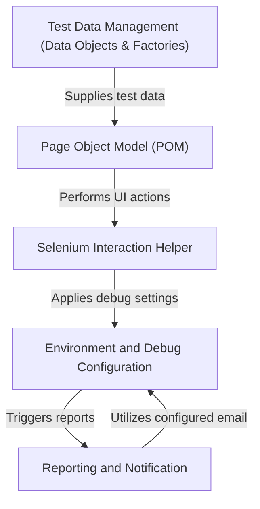

# Tutorial: Selenium-TestNG-Elite-Framework

The **Selenium TestNG Elite Framework** is a *robust* and *user-friendly* **test automation framework** designed for web applications. It leverages **Selenium WebDriver** for browser automation and **TestNG** for test management, providing a structured approach to automate UI tests. The framework offers features like *flexible environment configuration*, *smart element interactions*, *dynamic test data generation*, and *automatic reporting with email notifications* to simplify test creation and execution for developers.

**Source Repository:** [None](None)

## Chapters

1. [Environment and Debug Configuration
](01_environment_and_debug_configuration_.md)
2. [Test Data Management (Data Objects & Factories)
](02_test_data_management__data_objects___factories__.md)
3. [Page Object Model (POM)
](03_page_object_model__pom__.md)
4. [Selenium Interaction Helper
](04_selenium_interaction_helper_.md)
5. [Reporting and Notification
](05_reporting_and_notification_.md)

---

Generated by [AI Codebase Knowledge Builder](https://github.com/The-Pocket/Tutorial-Codebase-Knowledge)